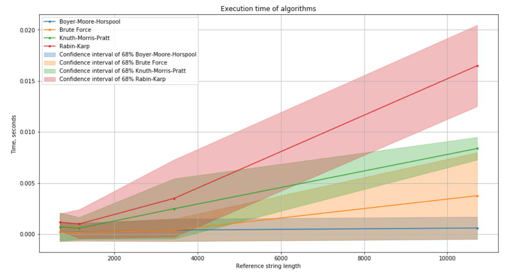
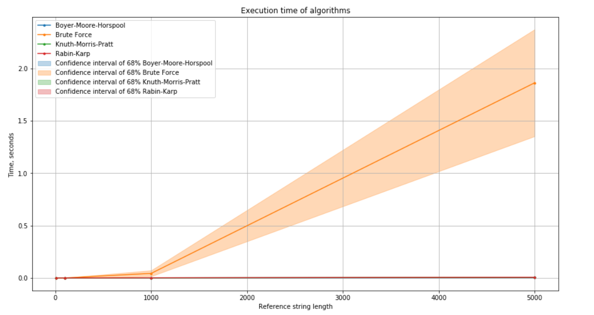

# StringSearch
The research work on string search algorithms
---
### *`goodXXX.txt`*  benchmarks 
*5 observations for each algorithm* 

|    | file    | Algorithm            |  Time (mean), sec. |  Time (std), sec. |   N operations |
|---:|:-------------|:---------------------|-----------------:|----------------:|-------------:|
|  0 | good_t_1.txt | Boyer-Moore-Horspool |           0.0002 |          0.0004 |           88 |
|  1 | good_t_1.txt | Brute Force          |           0.0002 |          0.0004 |           34 |
|  2 | good_t_1.txt | Knuth-Morris-Pratt   |           0.0007 |          0.0007 |         1233 |
|  3 | good_t_1.txt | Rabin-Karp           |           0.0012 |          0.0004 |          674 |
|  4 | good_t_2.txt | Boyer-Moore-Horspool |           0.0002 |          0.0004 |          124 |
|  5 | good_t_2.txt | Brute Force          |           0.0002 |          0.0004 |           85 |
|  6 | good_t_2.txt | Knuth-Morris-Pratt   |           0.0006 |          0.0005 |         1390 |
|  7 | good_t_2.txt | Rabin-Karp           |           0.001  |          0.0007 |          733 |
|  8 | good_t_3.txt | Boyer-Moore-Horspool |           0.0004 |          0.0005 |          487 |
|  9 | good_t_3.txt | Brute Force          |           0.0004 |          0.0005 |          445 |
| 10 | good_t_3.txt | Knuth-Morris-Pratt   |           0.0025 |          0.0015 |         4025 |
| 11 | good_t_3.txt | Rabin-Karp           |           0.0035 |          0.0019 |         2169 |
| 12 | good_t_4.txt | Boyer-Moore-Horspool |           0.0006 |          0.0005 |          551 |
| 13 | good_t_4.txt | Brute Force          |           0.0038 |          0.0021 |           92 |
| 14 | good_t_4.txt | Knuth-Morris-Pratt   |           0.0084 |          0.0006 |        19228 |
| 15 | good_t_4.txt | Rabin-Karp           |           0.0165 |          0.002  |        10318 |

---

### *`badXXX.txt`*  benchmarks 
*5 observations for each algorithm* 

|    | file    | Algorithm            |  Time (mean), sec. |  Time (std), sec. |   N operations |
|---:|:------------|:---------------------|-----------------:|----------------:|-------------:|
|  0 | bad_t_1.txt | Boyer-Moore-Horspool |           0      |          0      |           11 |
|  1 | bad_t_1.txt | Brute Force          |           0      |          0      |           10 |
|  2 | bad_t_1.txt | Knuth-Morris-Pratt   |           0      |          0      |           20 |
|  3 | bad_t_1.txt | Rabin-Karp           |           0      |          0      |           11 |
|  4 | bad_t_2.txt | Boyer-Moore-Horspool |           0      |          0      |          101 |
|  5 | bad_t_2.txt | Brute Force          |           0.0003 |          0.0004 |          820 |
|  6 | bad_t_2.txt | Knuth-Morris-Pratt   |           0.0002 |          0.0004 |          208 |
|  7 | bad_t_2.txt | Rabin-Karp           |           0.0002 |          0.0004 |          101 |
|  8 | bad_t_3.txt | Boyer-Moore-Horspool |           0.0008 |          0.0008 |         1001 |
|  9 | bad_t_3.txt | Brute Force          |           0.0435 |          0.0142 |        89200 |
| 10 | bad_t_3.txt | Knuth-Morris-Pratt   |           0.0008 |          0.0004 |         2098 |
| 11 | bad_t_3.txt | Rabin-Karp           |           0.0016 |          0.0005 |         1001 |
| 12 | bad_t_4.txt | Boyer-Moore-Horspool |           0.0033 |          0.001  |         5001 |
| 13 | bad_t_4.txt | Brute Force          |           1.8613 |          0.255  |      3997000 |
| 14 | bad_t_4.txt | Knuth-Morris-Pratt   |           0.0058 |          0.0018 |        10998 |
| 15 | bad_t_4.txt | Rabin-Karp           |           0.0067 |          0.0013 |         5001 |

---
